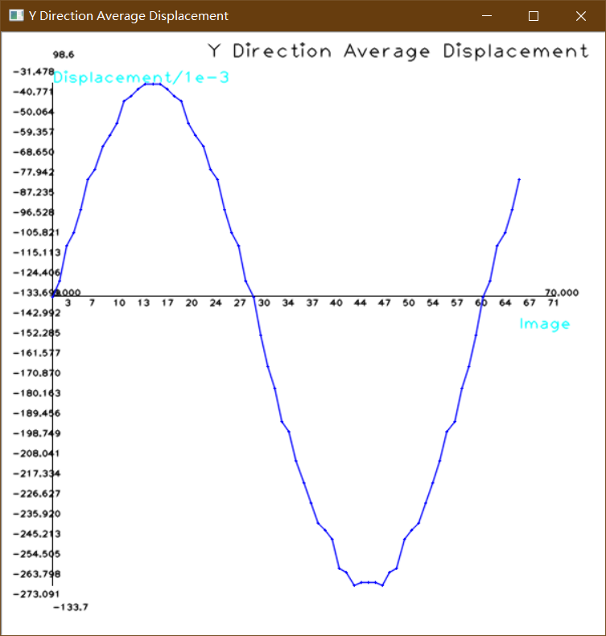
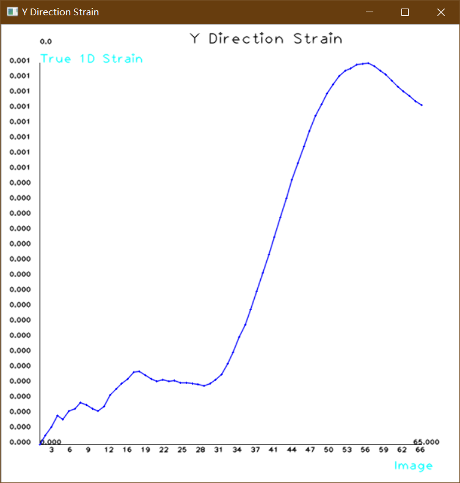

# Digital_Image_Correlation

** 声明：本程序是将 [Matlab数字图像相关程序](https://ww2.mathworks.cn/matlabcentral/fileexchange/12413-digital-image-correlation-and-tracking) 翻译成Opencv下C++程序。

## 环境：
  Win10 、Opencv3.4.5 、Visual Studio 2017
  
## 说明
- grid_generator.cpp  画网格，并生成X和Y方向的坐标数据-> grid_x.xml 和 grid_y.xml
- cplot.h 画类似matlab风格数据图必要文件
- cpcorr.cpp 核心函数文件，对应Matlab的cpcorr.m函数文件
- main.cpp main文件
  
 ## Example
 image 文件夹下是测试图片，一个白色圆形做振幅为3的正弦运动。
 
   
